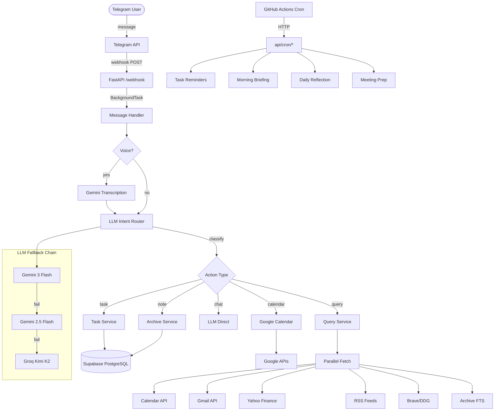

# AI Super Man

> An AI-powered personal assistant that lives in Telegram — manages tasks, calendar, notes, email, market data, and more through natural language conversation.


---

## Features

**Natural Language Understanding**
- LLM-powered intent classification into 5 action types (task, calendar, note, query, chat)
- Hebrew and English input with confidence-based routing and ambiguity handling
- Voice message transcription via Gemini

**Task Management**
- Create, complete, edit, delete tasks via natural language
- Recurring tasks (daily/weekly/monthly) with auto-spawn
- Smart duplicate detection using substring + word-overlap matching
- Effort estimation and priority levels
- Schedule tasks into free calendar slots automatically

**Google Integration (OAuth 2.0)**
- Calendar: create events, view schedule, detect conflicts, find free slots
- Gmail: read recent emails, search by sender, unread count
- Encrypted refresh token storage (Fernet/PBKDF2)

**Knowledge & Memory**
- Save notes with auto-tagging
- URL content extraction + LLM summarization
- Full-text search on saved notes (PostgreSQL `tsvector`)
- Permanent insight system with daily reflection and confidence decay
- Interaction logging for conversational continuity

**Daily Intelligence**
- Morning briefing: calendar + tasks + AI news + stock market + email digest + AI-market synergy analysis
- Meeting prep: fetches attendee email history + related notes before meetings
- Evening wrap-up and weekly review
- Proactive alerts: overdue tasks, urgent emails, stock moves, weather

**Data Sources**
- Stock market data from Yahoo Finance with configurable watchlist
- AI news aggregation from curated RSS feeds (TechCrunch, The Verge, MIT Tech Review)
- Web search via Brave API with DuckDuckGo fallback

---

## Architecture



---

## Tech Stack

| Component | Technology |
|-----------|-----------|
| Bot Framework | [aiogram](https://docs.aiogram.dev/) (async Telegram framework) |
| Backend | [FastAPI](https://fastapi.tiangolo.com/) + Uvicorn |
| Database | [Supabase](https://supabase.com/) (PostgreSQL) |
| Primary LLM | Google Gemini 3 Flash / 2.5 Flash |
| Fallback LLM | Groq (Kimi K2) |
| Google APIs | Calendar v3 + Gmail v1 (OAuth 2.0) |
| Search | Brave Search API / DuckDuckGo fallback |
| Market Data | Yahoo Finance Chart API |
| News | RSS feeds via feedparser |
| Deployment | [Render](https://render.com/) (free tier) |
| Scheduling | GitHub Actions (cron triggers) |
| Encryption | Fernet (PBKDF2-derived keys) |

---

## Getting Started

### Prerequisites

- Python 3.11+
- A Telegram bot token (from [@BotFather](https://t.me/BotFather))
- A [Supabase](https://supabase.com/) project
- A [Google Cloud](https://console.cloud.google.com/) project with Calendar and Gmail APIs enabled
- API keys for [Google AI Studio](https://aistudio.google.com/) (Gemini) and [Groq](https://console.groq.com/)

### Installation

```bash
git clone https://github.com/your-username/AI_Super_man.git
cd AI_Super_man

python -m venv venv
source venv/bin/activate  # Windows: venv\Scripts\activate

pip install -r requirements.txt
```

### Configuration

```bash
cp .env.example .env
# Edit .env with your API keys and credentials
```

See [`.env.example`](.env.example) for all required and optional environment variables.

### Database Setup

Create the following tables in your Supabase project. The required schema:

- `users` — Telegram user ID + encrypted Google refresh token
- `tasks` — Task title, due date, priority, status, recurrence, effort
- `archive` — Notes with tags and full-text search
- `interaction_log` — Conversation history for memory and deduplication
- `permanent_insights` — LLM-extracted user insights with confidence scores
- `pending_confirmations` — Persisted confirmation flow state
- `follow_ups` — Extracted commitments from conversations

For full-text search on the archive, run:

```sql
ALTER TABLE archive ADD COLUMN IF NOT EXISTS fts tsvector
    GENERATED ALWAYS AS (to_tsvector('simple', coalesce(content, ''))) STORED;
CREATE INDEX IF NOT EXISTS idx_archive_fts ON archive USING GIN (fts);
CREATE INDEX IF NOT EXISTS idx_archive_tags ON archive USING GIN (tags);
```

### Running Locally

```bash
uvicorn app.main:app --host 0.0.0.0 --port 8000 --reload
```

For local development with Telegram webhooks, use [ngrok](https://ngrok.com/):

```bash
ngrok http 8000
# Then call /setup-webhook with your ngrok URL
```

### Running Tests

```bash
pip install pytest pytest-asyncio
pytest tests/ -v
```

---

## Project Structure

```
app/
├── main.py                    # FastAPI entry point, webhook, health check
├── core/
│   ├── config.py              # Environment configuration (pydantic-settings)
│   ├── database.py            # Supabase client
│   ├── llm.py                 # LLM wrapper with 3-tier fallback chain
│   ├── security.py            # Token encryption (Fernet/PBKDF2)
│   ├── cache.py               # In-memory TTL cache
│   └── prompts.py             # System prompts and bot identity
├── bot/
│   ├── loader.py              # Bot + Dispatcher initialization
│   ├── handler.py             # Message processing pipeline
│   ├── middleware.py           # User authorization (ID whitelist)
│   └── routers/
│       ├── tasks.py            # Telegram command handlers
│       ├── auth.py             # Google OAuth flow
│       ├── google_routes.py    # /login, /today commands
│       └── cron.py             # Scheduled job endpoints
├── models/
│   ├── schemas.py              # Task Pydantic models
│   └── router_models.py        # Intent classification models
└── services/
    ├── router_service.py       # LLM intent classifier
    ├── task_service.py         # Task CRUD + matching + recurrence
    ├── query_service.py        # Context-aware query answering
    ├── google_svc.py           # Google Calendar + Gmail
    ├── archive_service.py      # Notes + full-text search
    ├── memory_service.py       # Interaction logging + insights
    ├── briefing_service.py     # Morning briefing orchestrator
    ├── heartbeat_service.py    # Proactive check-ins
    ├── market_service.py       # Stock data (Yahoo Finance)
    ├── news_service.py         # AI news (RSS feeds)
    ├── search_service.py       # Web search (Brave/DDG)
    ├── synergy_service.py      # AI-market insight synthesis
    └── url_service.py          # URL extraction + summarization
```

---

## API Endpoints

| Method | Endpoint | Description |
|--------|----------|-------------|
| `POST` | `/webhook` | Telegram webhook receiver |
| `GET` | `/health` | Health check |
| `GET` | `/setup-webhook` | One-time webhook registration |
| `GET` | `/auth/login` | Initiate Google OAuth flow |
| `GET` | `/auth/callback` | OAuth callback handler |
| `GET` | `/api/cron/check-reminders` | Trigger task + email + stock + weather alerts |
| `GET` | `/api/cron/daily-brief` | Send morning briefing |
| `GET` | `/api/cron/daily-reflection` | Run insight extraction |
| `GET` | `/api/cron/meeting-prep` | Send pre-meeting briefs |
| `GET` | `/api/cron/heartbeat` | Proactive check-in / evening wrap-up |
| `GET` | `/api/cron/weekly-review` | Weekly summary |

All `/api/cron/*` endpoints require `Authorization: Bearer <CRON_SECRET>` header.

---

## Cron Jobs (GitHub Actions)

| Workflow | Schedule | Endpoint |
|----------|----------|----------|
| `scheduler.yml` | Every 30 min | `/api/cron/check-reminders` |
| `morning-brief.yml` | Daily 06:00 UTC | `/api/cron/daily-brief` |
| `daily-reflection.yml` | Daily (evening) | `/api/cron/daily-reflection` |
| `meeting-prep.yml` | Every 15 min | `/api/cron/meeting-prep` |
| `heartbeat.yml` | Mid-week + evening | `/api/cron/heartbeat` |

---

## Key Design Decisions

- **3-tier LLM fallback**: Gemini 3 Flash → Gemini 2.5 Flash → Groq. Each tier retries once before falling back. The wrapper normalizes all responses to a `ChatCompletion`-compatible interface.
- **Parallel context fetching**: Query answering fetches calendar, tasks, emails, news, and market data simultaneously via `asyncio.gather`, keeping response times under 10 seconds.
- **Webhook deduplication**: Each update is checked against `interaction_log.telegram_update_id` to prevent duplicate processing from Telegram retries.
- **Persisted confirmation flow**: Destructive actions (delete, complete-all) require confirmation. State is stored in Supabase, surviving server restarts.
- **Insight confidence decay**: Permanent insights lose 2% confidence per week if not reinforced, preventing stale data from polluting context.

---

## License

[MIT](LICENSE)

---

Built by **Shay Feldboy**
